---

## 🚀 What I'm Building

- 🔧 **[web2apk](https://github.com/arc2898/web2apk)** — Convert any website into an Android APK in minutes, with a custom app name, icon, and URL.
- 🖥️ **[termsnapshot](https://github.com/arc2898/termsnapshot)** — Record terminal sessions as shareable JSON, replay them anywhere with no vendor lock-in.
- 🧩 **[terming](https://github.com/arc2898/terming)**, **[termimg](https://github.com/arc2898/termimg)**, **[clipsync](https://github.com/arc2898/clipsync)** — small tools around terminal workflows and clipboard syncing.
- 🐧 **My own Linux distro** — building a custom Linux distribution from the ground up.
- 🤖 **A Linux AI assistant** — with both GUI and CLI interfaces.
- 🗄️ **[OS-Vault](https://os-vault.neocities.org)** — a cloud storage website. Live at [os-vault.neocities.org](https://os-vault.neocities.org), with [v2](https://os-vault.neocities.org/v2/) still in active development.
- 📱 **FepTera app suite** — a mobile app family: **FepTera Files**, **FepTera Video**, **FepTera Music**, **FepTera Gallery**.
- 🌍 Working toward releasing more of these as **open source projects** over time.

---

## 🏁 FepTera

I founded and led **FepTera** — the name blends *Fe(mo)* + *(Pe)ta*, standing for a **new era**. It started as a team for hackathons, and while there's no fixed plan yet for what comes next, it might grow into something more down the line — maybe even a startup.

---

## 💻 Tech Stack

---

## 🌱 Currently

Exploring ideas, building small tools, and figuring out what's next — one repo at a time.

---

📫 Reach me here on GitHub · [arc2898](https://github.com/arc2898)

